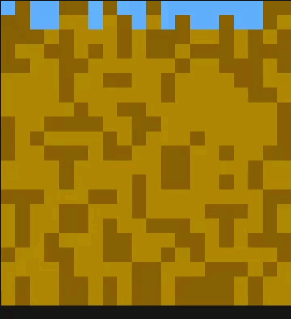

# Percolation

Une entreprise vaudoise vous mandate pour étudier un modèle de percolation en milieu poreux. Le milieu est modélisé par une matrice aléatoire d'entiers qui détermine les sites qui peuvent être envahis par l'eau et ceux qui sont imperméables.

Une matrice percole s'il existe un chemin d'eau allant de la ligne supérieure vers la ligne inférieure. L'animation suivante montre l'infiltration de l'eau dans la matrice.

<p align="center">
  
</p>

## Cahier des charges

On vous demande un programme simple permettant de déterminer si une matrice à deux dimensions percole ou non. Par exemple, la matrice suivante ne percole pas car l'eau ne pénètre pas jusqu'en bas. On Observe que l'eau s'arrête au niveau 6 et qu'elle n'a de ce fait aucune possibilté d'atteindre le niveau 7.

```console
1 1 2 1 2 2 1 2 2 1  (1)
2 1 1 2 2 1 1 1 2 1  (2)
2 2 2 2 2 2 1 1 2 2  (3)
2 2 1 2 2 1 1 2 2 1  (4)
1 1 0 1 2 2 2 2 2 2  (5)
0 0 1 1 1 2 2 1 1 1  (6)
0 0 1 0 1 1 1 0 0 1  (7)
0 1 1 1 1 1 0 1 0 0  (8)
1 0 1 1 0 1 1 0 0 0  (9)
0 1 0 0 0 0 0 0 0 1  (A)
```

La convention utilisée est `0` pour un vide ou pore, `1` pour un obstacle imperméable et `2` pour l'eau.

Notez que l'eau ne peut circuler que horizontalement et verticalement et d'aucune manière en diagonale.

La démarche est la suivante :

1. Créer une matrice de 20 par 20
2. La remplir avec des valeurs aléatoires (`0` ou `1`)
3. Tester la percolation
4. Afficher la matrice
5. Dire si oui ou non la matrice percole

## De l'aide ?

Google est votre allié au quotidien :

- `how to create a 2 dimensional array in c` ;
- `how to generate random number in c`.

## Plus de couleurs ?

Au lieu d'afficher `0`, `1` ou `2`, il est possible d'utiliser les caractères d'échappement ANSI du terminal. Attention, cela ne fonctionne que sur un terminal POSIX couleur. Par exemple essayez `printf("\e[48;5;75mBLEU\e[0m\n");`

Vous n'êtes pas familier de cette étrange écriture : vous trouverez de l'information intéressante [ici](https://www.lihaoyi.com/post/BuildyourownCommandLinewithANSIescapecodes.html).
